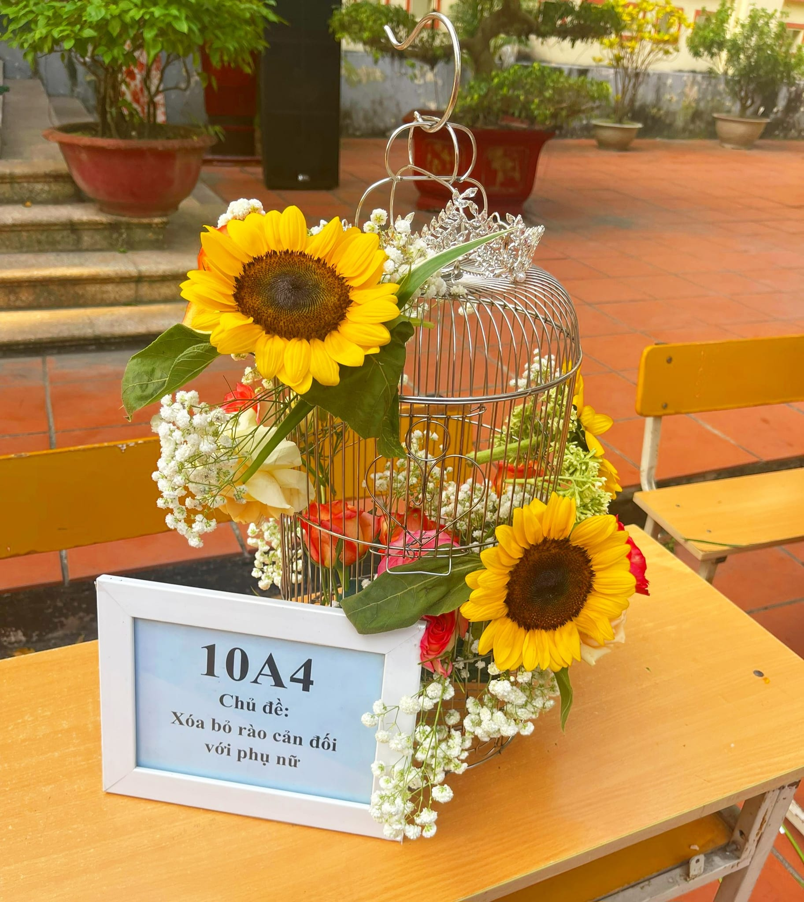

# The Captivating World of Viktor Alcaraz’s Street Photography

Viktor Alcaraz’s street photography has captured the attention and admiration of art enthusiasts around the globe. With an unparalleled ability to seize the raw and unfiltered moments of everyday life, Alcaraz has carved a niche for himself in the realm of contemporary photography. His work transcends mere visual documentation, offering profound narratives that resonate on both emotional and intellectual levels. This extensive exploration delves into the distinctive aspects of Alcaraz’s street photography, examining his stylistic choices, thematic concerns, and the impact of his work on modern photographic practice.

## The Artist Behind the Lens

Born and raised in a bustling metropolis, Viktor Alcaraz was exposed to the dynamic and ever-changing tapestry of urban life from an early age. His fascination with the streets began as a child, when he would accompany his father, an avid amateur photographer, on photo walks through their city. This early exposure cultivated a deep appreciation for the candid moments and unnoticed details that characterize street life.

Alcaraz’s formal education in photography further honed his skills and artistic vision. Studying under renowned photographers, he absorbed a wealth of knowledge about composition, lighting, and the importance of narrative in visual art. However, it was his personal excursions into the streets, camera in hand, that truly shaped his unique approach. Alcaraz’s work is a testament to his belief that the most compelling stories are often found in the mundane and the overlooked.

## Stylistic Brilliance: Capturing the Essence of the Streets

Alcaraz’s street photography is distinguished by its impeccable composition and the evocative use of natural light. He has a keen eye for framing his subjects within their environments, often using architectural elements, reflections, and shadows to create visually striking images. His photographs are meticulously composed yet retain a sense of spontaneity, capturing the fluidity and unpredictability of urban life.

One of the hallmarks of Alcaraz’s style is his use of black and white photography. Stripping away the distractions of color, he focuses on the interplay of light and shadow, texture, and form. This choice imbues his images with a timeless quality, allowing viewers to engage more deeply with the subjects and the stories they tell. In the absence of color, the emotions and expressions of the people he photographs become more pronounced, drawing the viewer into their world.

Alcaraz’s approach to composition is both intuitive and deliberate. He often employs techniques such as leading lines, symmetry, and negative space to guide the viewer’s eye through the frame. His images are characterized by a balance between structure and chaos, reflecting the inherent contradictions of urban environments. Through his lens, the mundane becomes extraordinary, and the everyday scenes of city life are elevated to the realm of art.

## Thematic Depth: Narratives of Humanity

At the heart of Alcaraz’s street photography lies a deep empathy for his subjects. His work is a celebration of human diversity, capturing people from all walks of life in candid and unguarded moments. Alcaraz has a remarkable ability to connect with his subjects, often engaging them in conversation before taking their photograph. This rapport allows him to capture genuine expressions and emotions, creating images that resonate with authenticity.

One of the recurring themes in Alcaraz’s work is the concept of solitude amidst the crowd. Many of his photographs depict individuals lost in thought or engrossed in solitary activities, set against the backdrop of a bustling city. These images evoke a sense of introspection and highlight the juxtaposition of personal isolation and communal existence in urban spaces. Through these poignant portrayals, Alcaraz invites viewers to reflect on their own experiences of solitude and connection

Another prominent theme is the resilience and strength of ordinary people. Alcaraz’s photographs often feature individuals engaged in acts of labor, creativity, or kindness. Whether it’s a street vendor plying their trade, a musician performing on a corner, or a passerby offering a smile, these images celebrate the quiet dignity and perseverance of everyday life. Alcaraz’s work underscores the idea that every person has a story worth telling, and that beauty can be found in the most unexpected places.

## The Impact of Alcaraz’s Work

Viktor Alcaraz’s street photography has had a profound impact on the contemporary art world. His images have been exhibited in galleries and museums worldwide, earning him critical acclaim and a dedicated following. Critics and viewers alike praise his ability to capture the essence of human experience with honesty and compassion.

Alcaraz’s work has also influenced a new generation of photographers. His emphasis on narrative and emotional depth has inspired many to look beyond technical perfection and focus on the stories behind their subjects. In an era where photography is often dominated by curated and staged images, Alcaraz’s candid and unfiltered approach serves as a reminder of the power of authenticity.

Furthermore, Alcaraz’s commitment to social justice and advocacy through his photography has garnered widespread respect. He uses his platform to raise awareness about issues such as poverty, inequality, and homelessness. By shining a light on marginalized communities, he encourages viewers to confront uncomfortable realities and consider their own roles in fostering a more inclusive and compassionate society.

## The Emotional Resonance of Alcaraz’s Images

What sets Viktor Alcaraz’s street photography apart is its profound emotional resonance. Each image tells a story that invites viewers to engage on a personal level. Alcaraz’s photographs elicit a wide range of emotions, from joy and wonder to sadness and contemplation. This emotional depth is a testament to his skill as a storyteller and his ability to capture the human experience in all its complexity.

One particularly striking photograph shows an elderly woman sitting on a park bench, her weathered hands clasped in her lap. Her eyes, filled with a mix of nostalgia and resignation, gaze into the distance. The background, a blur of bustling activity, contrasts with her stillness, creating a poignant commentary on the passage of time and the quiet moments of reflection amidst the chaos of life. This image, like many of Alcaraz’s works, resonates deeply with viewers, evoking empathy and introspection.

## Conclusion: The Legacy of Viktor Alcaraz

Viktor Alcaraz’s street photography is a powerful exploration of humanity, capturing the beauty, complexity, and resilience of everyday life. Through his lens, the ordinary becomes extraordinary, and the fleeting moments of urban existence are transformed into timeless works of art. Alcaraz’s ability to connect with his subjects and convey their stories with authenticity and compassion sets him apart as one of the most compelling photographers of his generation.

His work serves as a reminder of the power of photography to document, inspire, and provoke thought. Alcaraz’s images encourage viewers to look beyond the surface and consider the deeper narratives that shape our lives. In doing so, he not only elevates the art of street photography but also fosters a greater appreciation for the richness and diversity of the human experience.

As Viktor Alcaraz continues to explore new cities and capture the stories of their inhabitants, his legacy grows. His photographs are not just visual records; they are windows into the soul of urban life, offering glimpses of the beauty, struggle, and resilience that define us all. Through his work, Alcaraz invites us to see the world with fresh eyes and to find the extraordinary in the everyday.

**_Author: Nguyễn Minh Chí_**

**_Contact email: minhchico300kc@hotmail.com_**

**_Copyright all rights reserved_**
