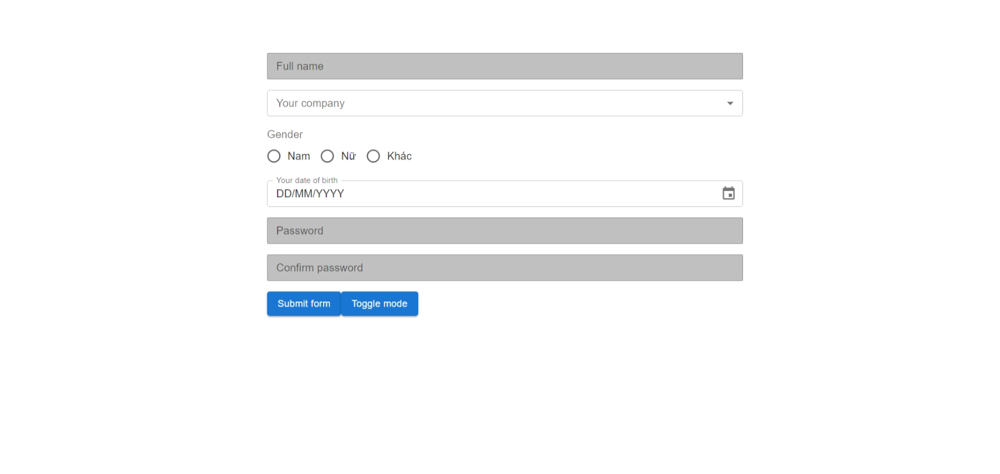
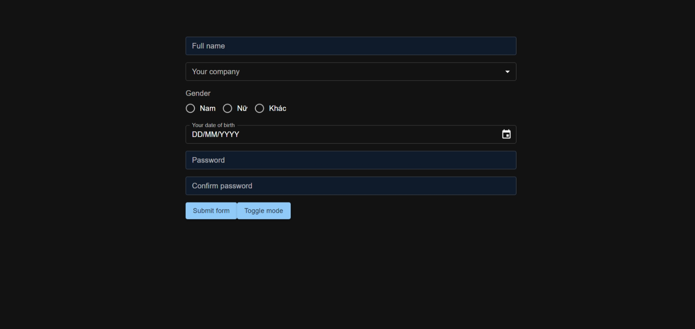

# Tùy chỉnh màu sắc chế độ light, dark mode trong Material UI

## Tạo custom theme cho Material UI

- Tạo file `custom-themes.ts` để tạo custom theme cho Material UI:

```ts
import { experimental_extendTheme as extendTheme } from "@mui/material/styles";

// Khai báo tên Palette ở cả 2 interface PaletteOptions và Palette
declare module "@mui/material/styles" {
  interface PaletteOptions {
    "bg-text-input": string;
  }
  interface Palette {
    "bg-text-input": string;
  }
}

const customTheme = extendTheme({
  cssVarPrefix: "",
  colorSchemes: {
    light: {
      palette: {
        "bg-text-input": "#C0C0C0", // Chỉ định màu ở light mode cho "bg-text-input"
      },
    },
    dark: {
      palette: {
        "bg-text-input": "#0f1a2a", // Chỉ định màu ở dark mode cho "bg-text-input"
      },
    },
  },
});

export default customTheme;
```

## Bọc component cần thiết lên đầu App

- Tiếp theo ở file `App.tsx`:

```tsx
import { Box, CssBaseline } from "@mui/material";
import {
  Experimental_CssVarsProvider as CssVarsProvider,
  StyledEngineProvider,
} from "@mui/material/styles";

import Home from "./pages/Home";
import customTheme from "./themes/custom-themes";

const App = () => {
  return (
    <StyledEngineProvider injectFirst>
      <CssVarsProvider theme={customTheme}>
        <CssBaseline />
        <Box
          sx={{
            minHeight: "100vh",
            width: "100%",
            maxWidth: "1200px",
            margin: "auto",
            paddingTop: 10,
            paddingLeft: 30,
            paddingRight: 30,
            paddingBottom: 30,
          }}
        >
          <Home />
        </Box>
      </CssVarsProvider>
    </StyledEngineProvider>
  );
};

export default App;
```

:::note

- Hầu hết các style của Material UI nằm ở cuối thẻ `head` trong HTML, nên nó sẽ có độ ưu tiên cao hơn. Nếu chúng ta muốn ghi đè các thuộc tính CSS thì lúc nào cũng phải thêm `!important` ở cuối giá trị của các thuộc tính CSS đó. Để tránh điều này, hãy bọc component `StyledEngineProvider` kèm thêm thuộc tính `injectFirst`.
- Bọc component `CssVarsProvider` với thuộc tính `theme` nhận giá trị là `customTheme` mà chúng ta đã tạo ở trên để có thể sử dụng các colors tùy chỉnh do chúng ta đã thiết lập.
- Lưu ý phải có `CssBaseline`, nếu không, dark mode sẽ không hoạt động.

:::

## Khai báo lại toàn bộ biến colors đã custom

- Tiếp theo, ta tạo file `_variables.scss`. Mục đích file này là định nghĩa lại biến chứa tất cả colors mà chúng ta đã custom để có thể sử dụng trong scss.

```scss
$bg-text-input: var(--palette-bg-text-input);
```

:::note

`--palette-bg-text-input` được tự động tạo bởi Material UI trong `:root`

:::

## Custom component của Material UI bằng SCSS

- Giờ ta tạo component `Input` được custom lại từ component `TextField` của Material UI:

```scss
@import "src/themes/variables";

.Input {
  & :global(.MuiFormHelperText-root) {
    margin-left: 3px;
  }
  & :global(.MuiInputBase-input) {
    background-color: $bg-text-input;
  }
}
```

```tsx
import React from "react";
import { TextField, TextFieldProps } from "@mui/material";
import styles from "./Input.module.scss";

type TInputProps = TextFieldProps & {};

const Input: React.FC<TInputProps> = ({ className, ...otherProps }) => {
  return (
    <TextField
      {...otherProps}
      size="small"
      fullWidth
      className={`${styles.Input} ${className}`}
    />
  );
};
export default Input;
```

## Custom component của Material UI bằng Inline styles

- Nếu ta không muốn tạo file `.scss` thì ta có thể sử dụng **inline styles** bằng thuộc tính `sx`:

```tsx
import React from "react";
import { TextField, TextFieldProps } from "@mui/material";

type TInputProps = TextFieldProps & {};

const Input: React.FC<TInputProps> = ({ sx, ...otherProps }) => {
  return (
    <TextField
      size="small"
      fullWidth
      sx={{
        ...sx,
        "& .MuiFormHelperText-root": { marginLeft: "3px" },
        "& .MuiInputBase-input": (theme) => ({
          backgroundColor: theme.palette["bg-text-input"],
        }),
      }}
      {...otherProps}
    />
  );
};
export default Input;
```

:::tip

Chỉ nên viết **inline styles** nếu số lượng CSS Properties cần tùy chỉnh là không nhiều. Các trường hợp còn lại (kể cả custom nested element) thì nên style bằng **SCSS Module**.

:::

## Tạo nút toggle giữa light mode và dark mode

- Tiếp theo ta sẽ tạo nút để di chuyển giữa **light mode** và **dark mode**: Ta sử dụng hook `useColorScheme()` do Material UI cung cấp.

```tsx
import { Button, useColorScheme } from "@mui/material";

const ToggleModeButton = () => {
  const { mode, setMode } = useColorScheme();
  return (
    <Button
      variant="contained"
      sx={{ mt: 2, textTransform: "none" }}
      onClick={() => {
        setMode(mode === "light" ? "dark" : "light");
      }}
    >
      Toggle mode
    </Button>
  );
};
```

## Kết quả





## Kết quả

- Link project: https://stackblitz.com/edit/cehrfkh-muszvv-nfn8pi-custom-dark-and-light-theme-mui?file=README.md
