# Hướng dẫn cài đặt MySQL

## Cài đặt MySQL

- Vào link sau tải file cài đặt: [Download MySQL Installer](https://dev.mysql.com/downloads/installer/)


- Chạy file **mysql-installer-community-8.0.32.0.msi** vừa mới tải xuống.

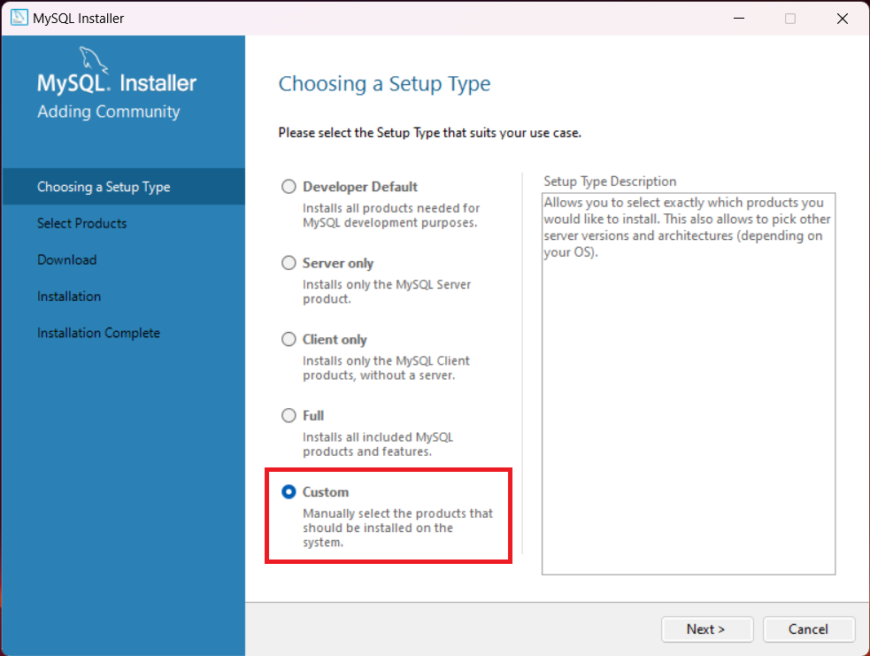

- Pick như hình dưới:

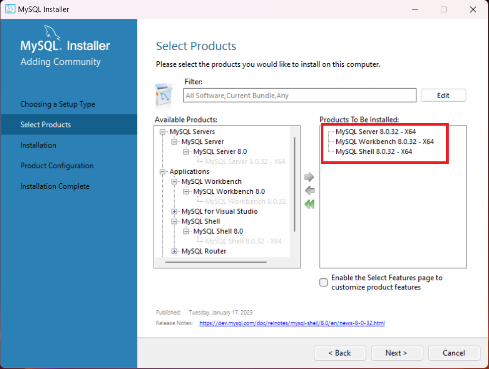

:::note

- Nếu không sử dụng MySQL Workbench (GUI để tương tác với CSDL) thì có thể bỏ qua không chọn

:::

- Bấm "Execute" để tiến hành cài đặt:

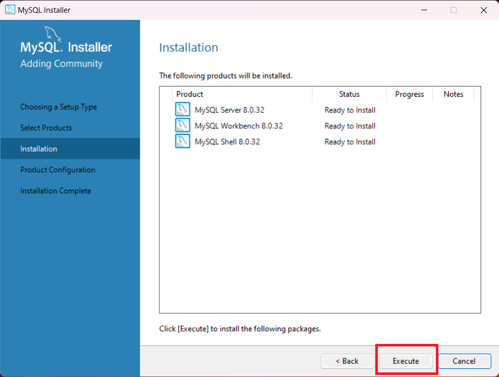

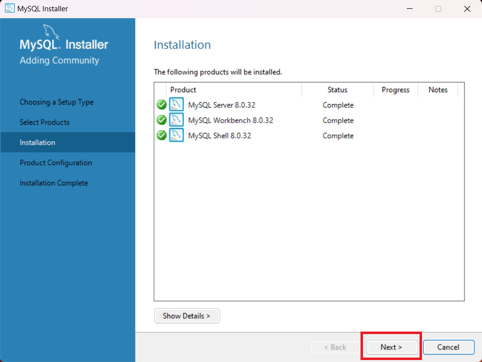

- Tiếp tục bấm "Next" để thực hiện cấu hình cho MySQL:

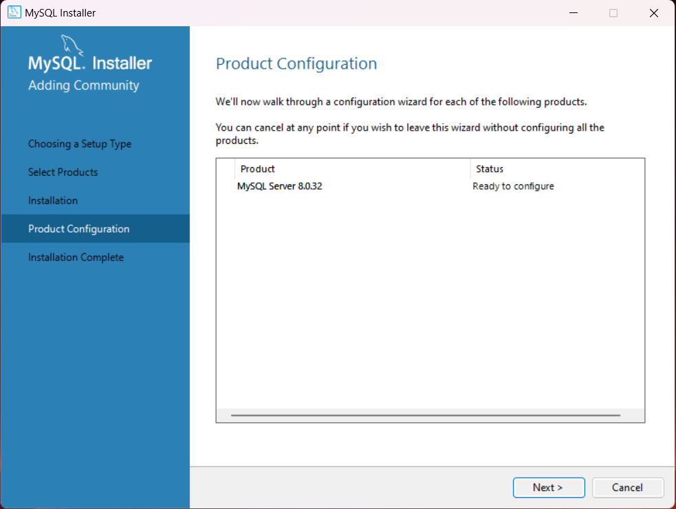

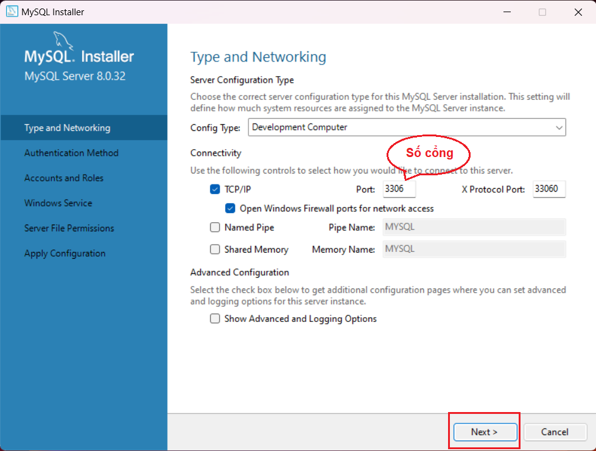

- Chọn phương thức xác thực cho MySQL và bấm "Next":

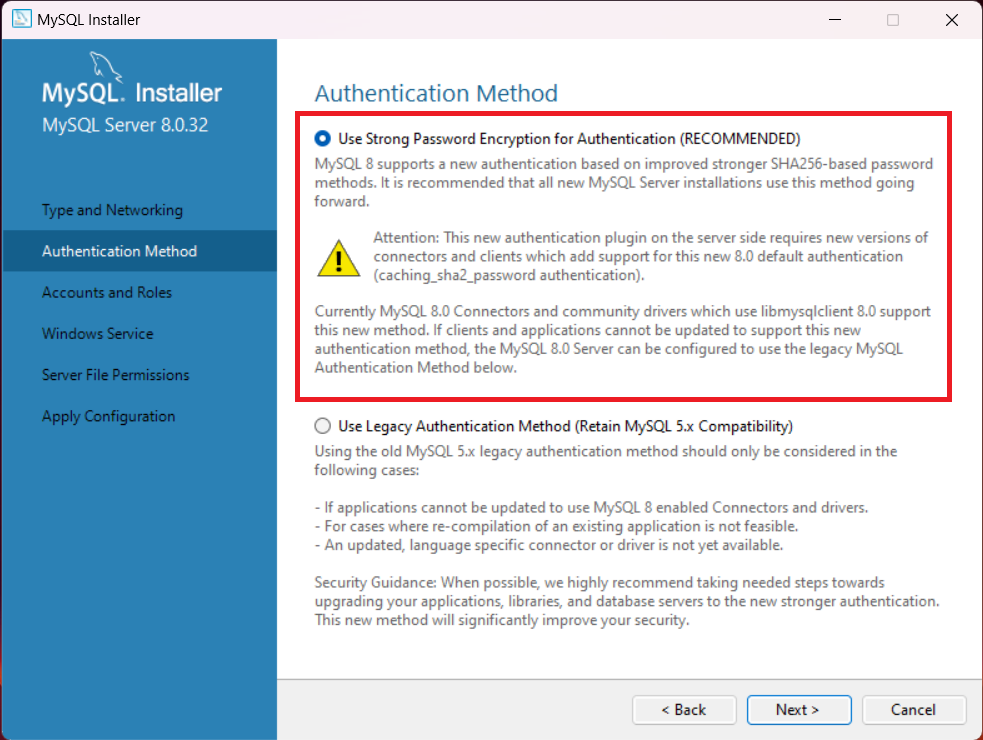

- Điền mật khẩu cho user "root" trong MySQL:

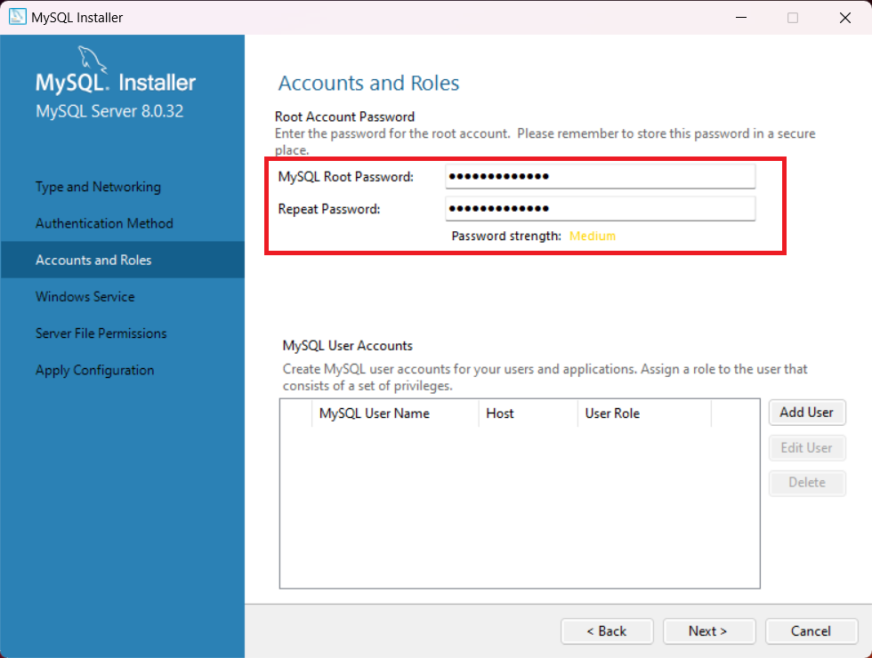

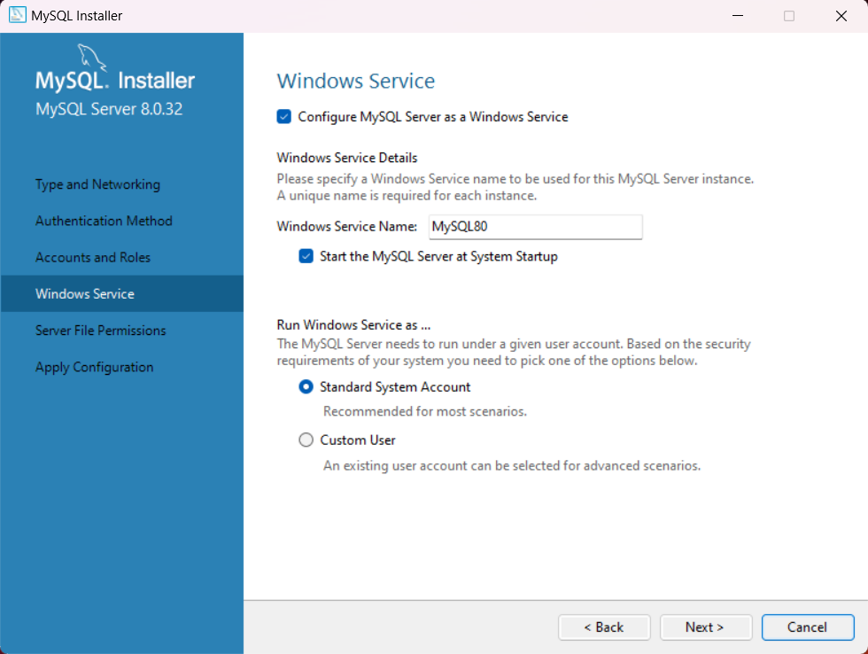


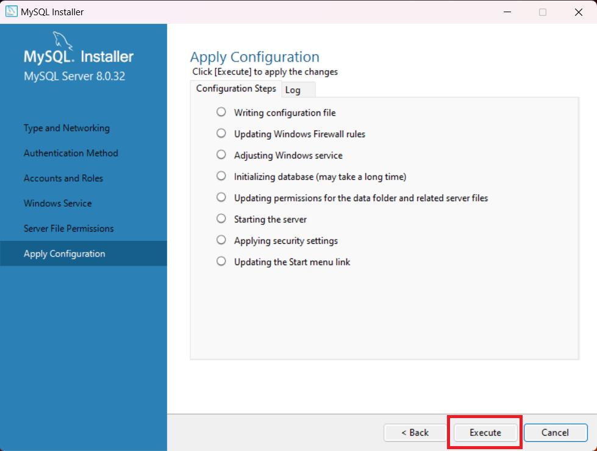

## Thêm biến môi trường cho MySQL

- Thêm biến môi trường này vào: **C:\Program Files\MySQL\MySQL Server 8.0\bin**

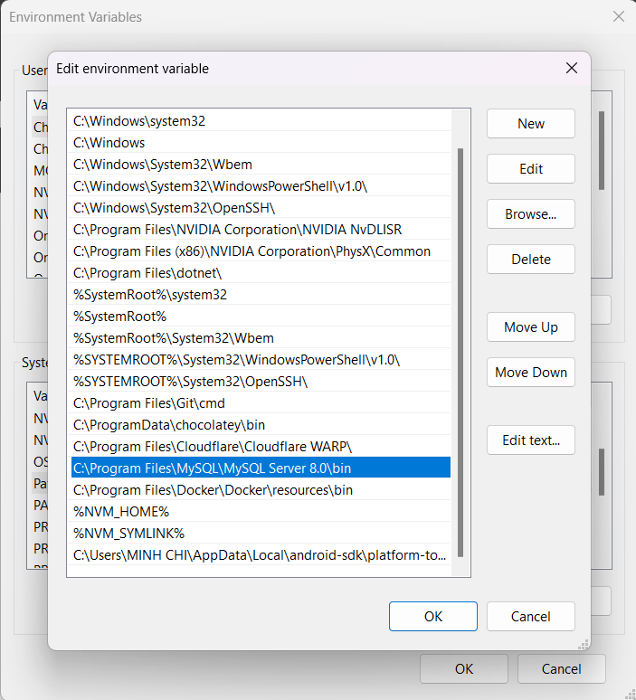

## Start, Stop MySQL Server

- Ta có thể thực hiện tắt, mở server MySQL bằng cách sử dụng lệnh sau (Với chế độ Administrator):

```bash
net start mysql80
```

```bash
net stop mysql80
```
