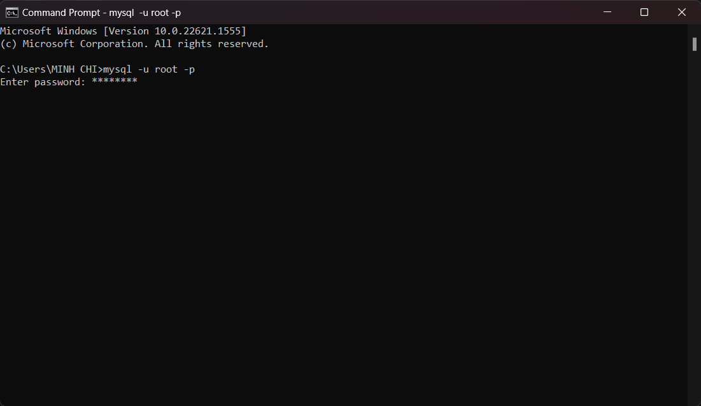

# Hướng dẫn cài đặt MySQL

## Cài đặt MySQL

- Vào link sau tải file cài đặt: [Download MySQL Installer](https://dev.mysql.com/downloads/installer/)


- Chạy file **mysql-installer-community-8.0.32.0.msi** vừa mới tải xuống.


- Pick như hình dưới:


:::note

- Nếu không sử dụng MySQL Workbench (GUI để tương tác với CSDL) thì có thể bỏ qua không chọn

:::

- Bấm "Execute" để tiến hành cài đặt:


- Tiếp tục bấm "Next" để thực hiện cấu hình cho MySQL:


- Chọn phương thức xác thực cho MySQL và bấm "Next":


- Điền mật khẩu cho user "root" trong MySQL:


## Thêm biến môi trường cho MySQL

- Thêm biến môi trường này vào: **C:\Program Files\MySQL\MySQL Server 8.0\bin**


## Thêm mới user cho MySQL

- Khi cấu hình cho MySQL, nó sẽ tự động tạo cho ta một username có tên **root** và mật khẩu như ta đã cấu hình ở trên
- Khi tạo một Connection với MySQL , ta phải điền username tồn tại trong hệ thống user của MySQL, nếu không sẽ không connect được.
- Để có thể tạo và cấp toàn bộ quyền cho một user mới, ta làm như sau:

* Mở cmd và gõ lệnh sau, sau đó nhập mật khẩu như ta đã cấu hình ở bên trên:

```bash
mysql -u root -p
```



- Giả sử ta muốn tạo mới một user có **username: minhchi1509** và **password: ptit_15092002**

```bash
CREATE USER 'minhchi1509'@'localhost' IDENTIFIED BY 'ptit_15092002';
```

- Sau khi tạo mới tài khoản, ta phải gán quyền cho nó, câu lệnh sau đây sẽ gán toàn bộ quyền cho user:

```bash
GRANT ALL PRIVILEGES ON *.* TO 'minhchi1509'@'localhost' WITH GRANT OPTION;
```

- Sau đó thực hiện làm mới các quyền để áp dụng thay đổi:

```bash
FLUSH PRIVILEGES;
```

:::note

- Câu lệnh để xem tất cả các user trong MySQL:

```bash
SELECT User, Host FROM mysql.user;
```

:::
