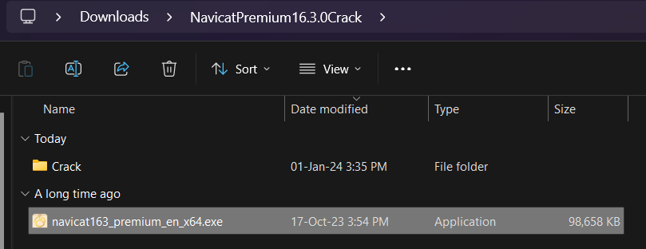
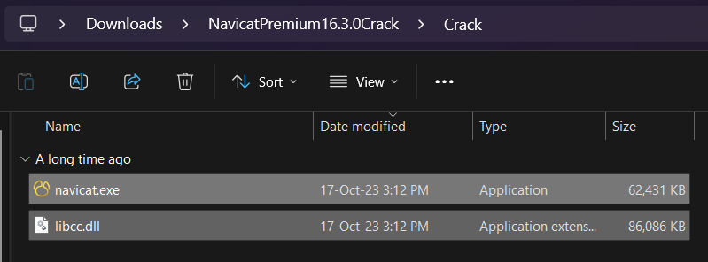
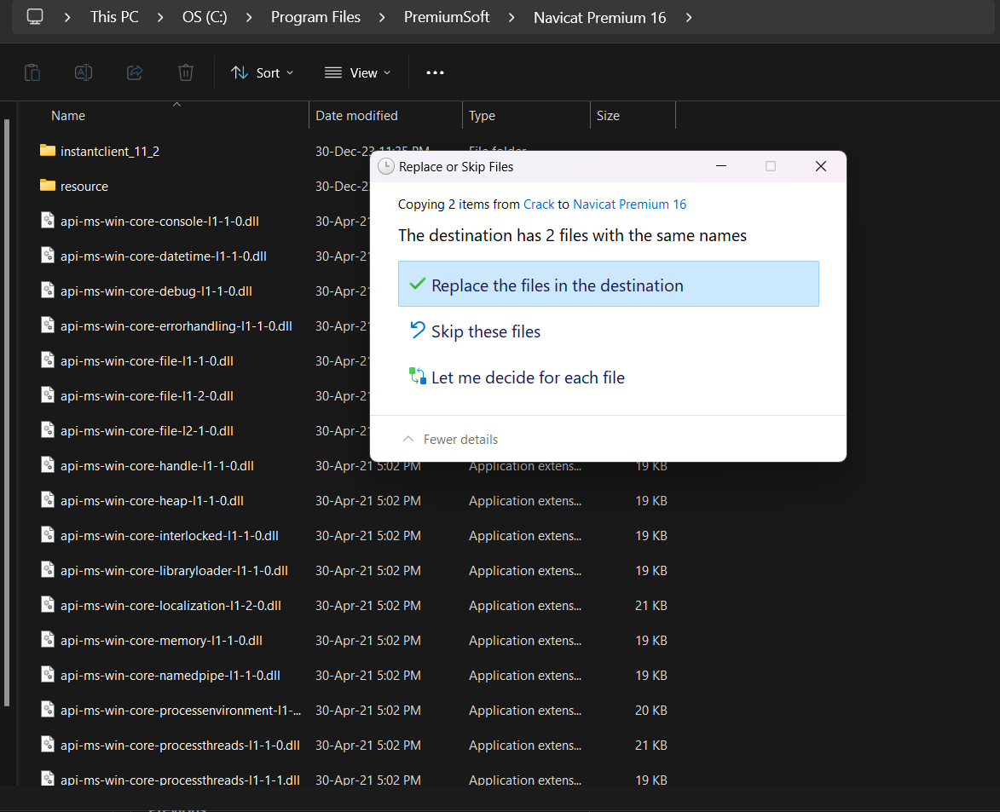
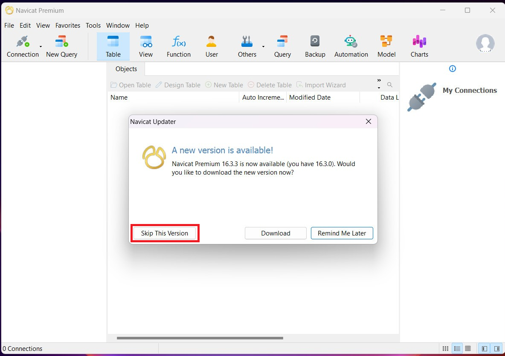
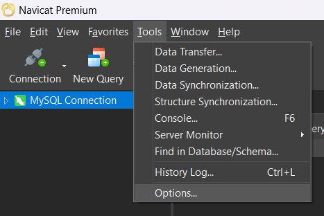
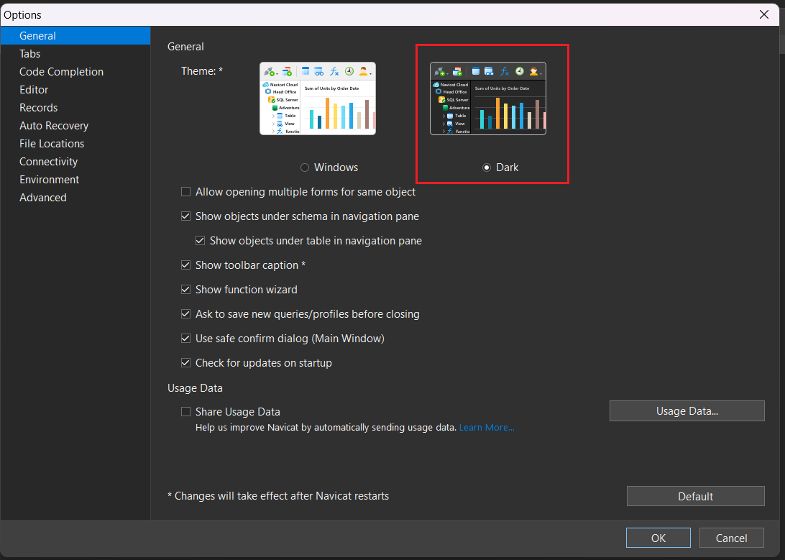
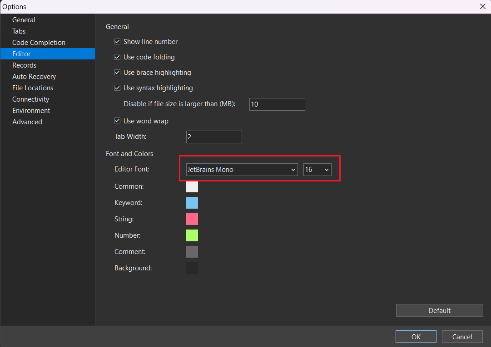
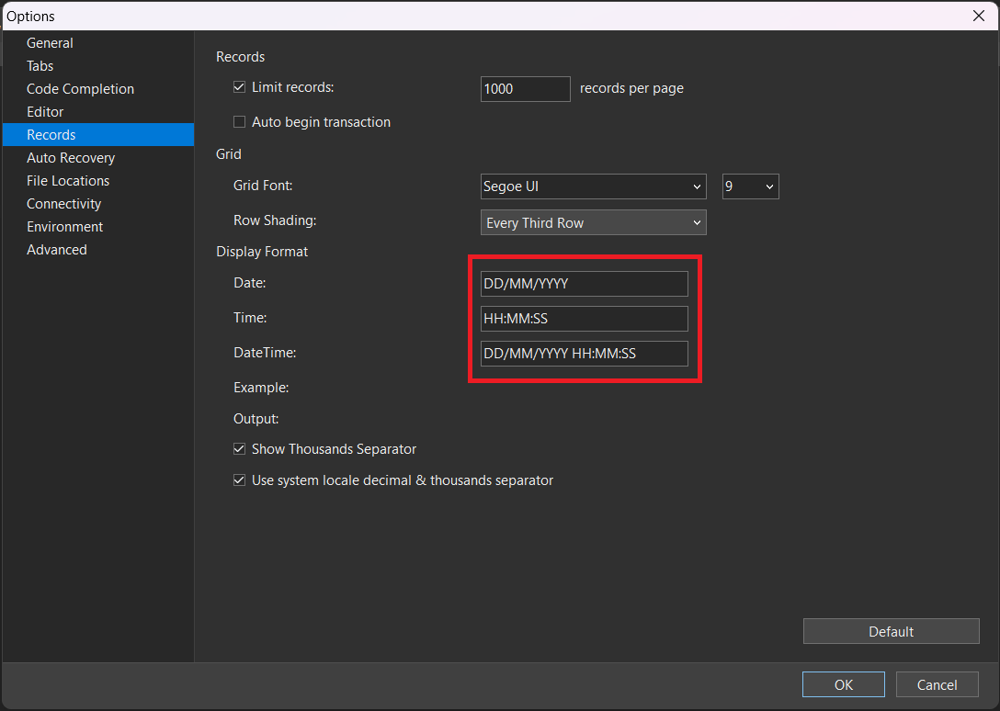

# Hướng dẫn crack Navicat Premium

## Navicat Premium là gì?

- Navicat Premium là một công cụ phát triển và quản lý cơ sở dữ liệu cho phép bạn kết nối đồng thời với nhiều cơ sở dữ liệu, bao gồm MySQL, MariaDB, MongoDB, SQL Server, Oracle, PostgreSQL và SQLite.
- Navicat Premium cung cấp một loạt các tính năng giúp bạn quản lý và phát triển cơ sở dữ liệu của mình một cách hiệu quả, bao gồm:

  - **Kết nối và quản lý nhiều cơ sở dữ liệu:** Navicat Premium cho phép bạn kết nối và quản lý nhiều cơ sở dữ liệu từ một ứng dụng duy nhất. Điều này giúp bạn dễ dàng quản lý các cơ sở dữ liệu của mình, ngay cả khi bạn có nhiều cơ sở dữ liệu khác nhau.
  - **Truy vấn và chỉnh sửa dữ liệu:** Navicat Premium cung cấp các công cụ mạnh mẽ để truy vấn và chỉnh sửa dữ liệu trong cơ sở dữ liệu của bạn. Bạn có thể sử dụng các truy vấn SQL tùy chỉnh hoặc sử dụng các công cụ truy vấn đồ họa của Navicat.
  - **Thiết kế và tạo cơ sở dữ liệu:** Navicat Premium cung cấp các công cụ mạnh mẽ để thiết kế và tạo cơ sở dữ liệu của bạn. Bạn có thể sử dụng các công cụ đồ họa của Navicat để tạo các bảng, chỉ mục, ràng buộc và các đối tượng cơ sở dữ liệu khác.
  - **Mô hình hóa cơ sở dữ liệu:** Navicat Premium cung cấp các công cụ mạnh mẽ để mô hình hóa cơ sở dữ liệu của bạn. Bạn có thể sử dụng các công cụ đồ họa của Navicat để tạo các sơ đồ cơ sở dữ liệu và các biểu đồ khác.
  - **Đồng bộ hóa dữ liệu:** Navicat Premium cung cấp các công cụ để đồng bộ hóa dữ liệu giữa các cơ sở dữ liệu. Điều này giúp bạn dễ dàng duy trì dữ liệu của mình nhất quán giữa các cơ sở dữ liệu.

- Navicat Premium là một công cụ mạnh mẽ và linh hoạt cho phép bạn quản lý và phát triển cơ sở dữ liệu của mình một cách hiệu quả. Nó là một lựa chọn tuyệt vời cho các nhà phát triển, quản trị viên cơ sở dữ liệu và người dùng kinh doanh.

## Cách crack Navicat Premium 16.3.7

- Tải về và giải nén file sau đây: [Crack Navicat Premium](https://drive.google.com/file/d/1ODgh6RmLDikD8SLotSfke6PnA-D_wm4G/view?usp=sharing) (Pass giải nén vui lòng liên hệ [Facebook](https://www.facebook.com/minhchi1509))
- Sau khi giải nén, tiến hành chạy file sau để cài đặt:

- Sau khi cài đặt sau, ta copy 2 file bên dưới ở thư mục Crack vào thư mục cài đặt Navicat Premium (thường nằm ở **C:\Program Files\PremiumSoft\Navicat Premium 16**)

- Sau đó, ta khởi động **Navicat Premium**, và nó sẽ cho ta dùng vĩnh viễn

:::caution

- Lưu ý: KHÔNG ĐƯỢC CẬP NHẬT VERSION NẾU NÓ YÊU CẦU

:::

## Thay đổi một số options cho Navicat Premium

- Vào **Tools** -> **Options**:

- Bật Dark mode:

- Thay đổi font chữ và cỡ chữ:

- Thay đổi cách hiển thị định dạng Datetime trong database:

