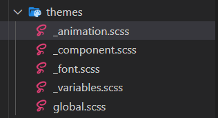
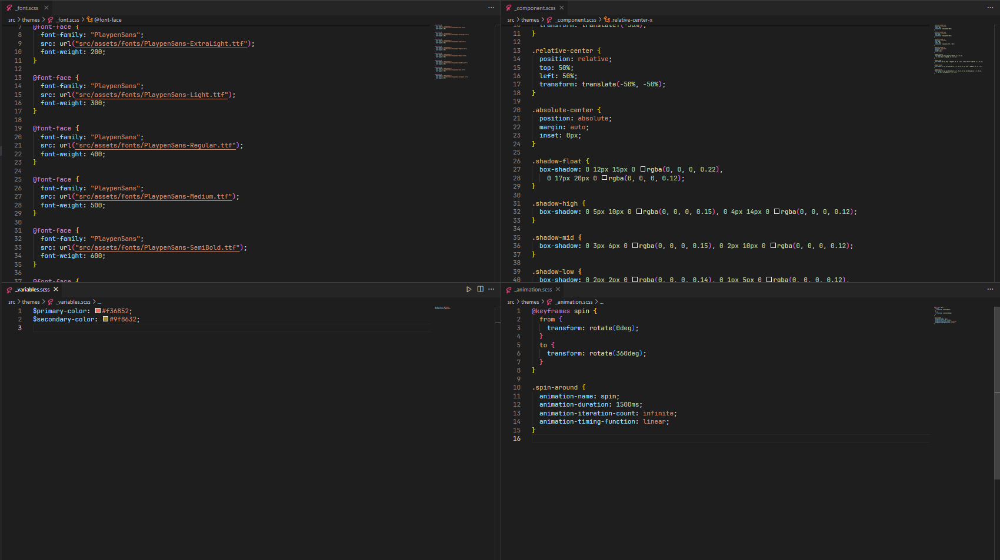
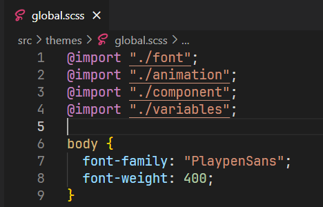
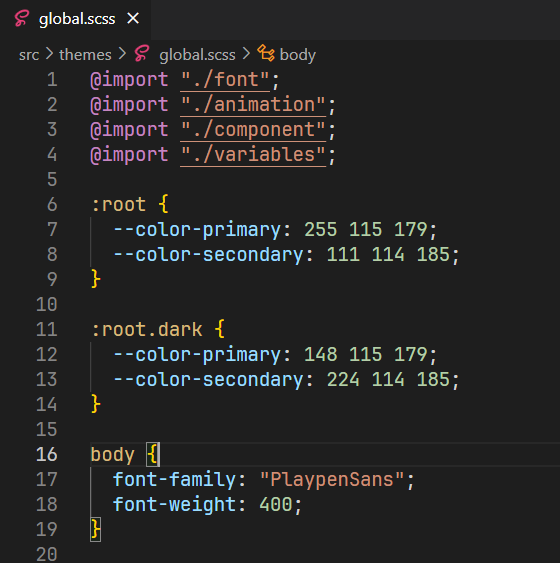
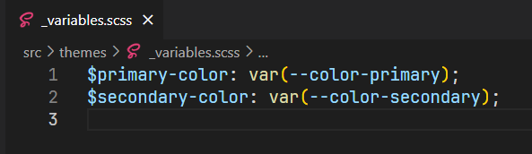
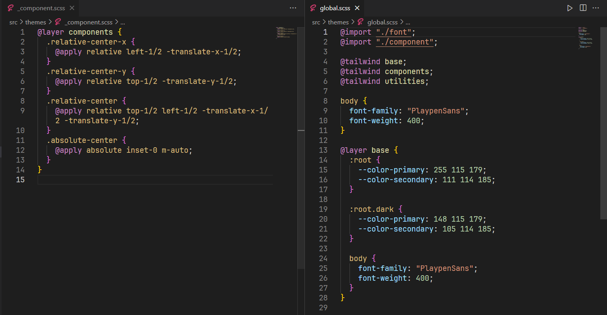
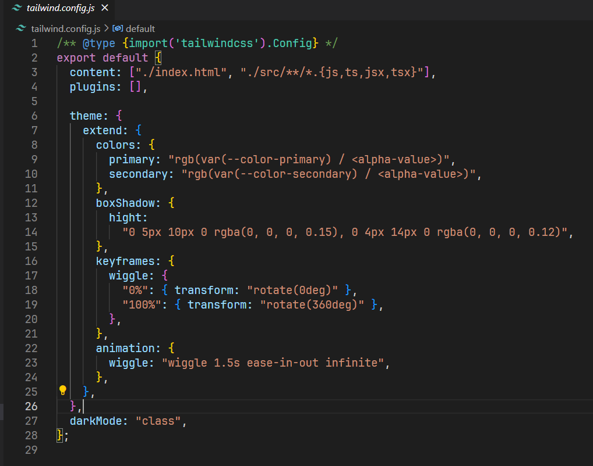

# Cách bố trí các file style (SCSS, Tailwind) trong Reactjs

## Project sử dụng style thuần (SCSS)

- Cấu trúc file:

:::note

Trong đó:

- **\_animation.scss**: file định nghĩa keyframe và các class animation
- **\_component.scss**: file định nghĩa các class tái sử dụng nhiều lần
- **\_font.scss**: file định nghĩa font
- **\_variables.scss**: file định nghĩa các biến css (như color, font-size,...)
- **global.scss**: file root css cho app

:::

:::tip

Nếu project có sử dụng dark, light mode thì hãy sử dụng `:root` để khai báo màu trong đó, tương ứng với các chế độ light và dark. Nếu muốn sử dụng chế độ dark thì ta chỉ việc thêm `class="dark"` vào thẻ `html`. Cách làm này 1 biến có thể sử dụng được ở các chế độ khác nhau, rất thuận tiện:

:::

## Project sử dụng TailwindCSS

- Nếu sử dụng TailwindCSS, thì chỉ cần tạo các file sau:

  - **\_font.scss** (file này giữ nguyên giống y hệt bên trên, nó chỉ để import các file font local)
  - **\_component.scss**
  - **\_global.scss**

- Còn lại, nếu muốn thêm color,... hay custom CSS Property nào đó, hãy cấu hình ở trong file **tailwind.config.js**

:::tip

Tương tự như ở trên, nếu có sử dụng light, dark mode, hãy khai báo color ở `:root` và `:root.dark` và thêm tên biến ứng với màu đó ở trong file **tailwind.config.js**

:::
