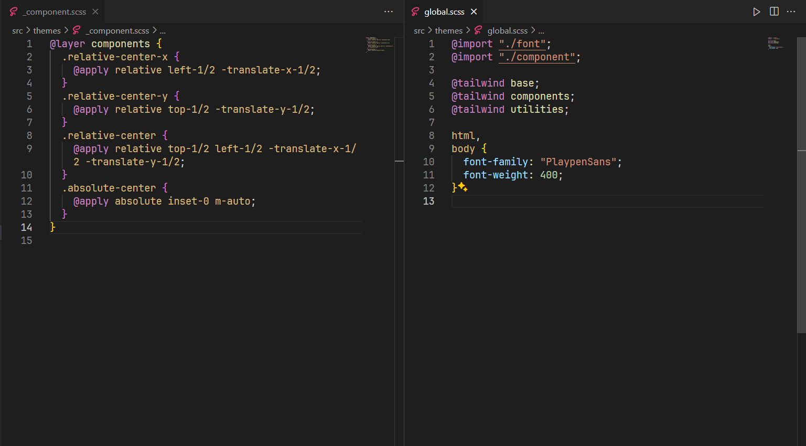

# Cách bố trí các file style (SCSS, Tailwind) trong Reactjs

## Project sử dụng style thuần (SCSS)

- Cấu trúc file:


:::note

Trong đó:

- **\_animation.scss**: file định nghĩa keyframe và các class animation
- **\_component.scss**: file định nghĩa các class tái sử dụng nhiều lần
- **\_font.scss**: file định nghĩa font
- **\_variables.scss**: file định nghĩa các biến css (như color, font-size,...)
- **global.scss**: file root css cho app

:::


:::tip

Nếu project có sử dụng dark, light mode thì hãy sử dụng `:root` để khai báo màu trong đó, tương ứng với các chế độ light và dark. Nếu muốn sử dụng chế độ dark thì ta chỉ việc thêm `class="dark"` vào thẻ `html`. Cách làm này 1 biến có thể sử dụng được ở các chế độ khác nhau, rất thuận tiện:


:::

## Project sử dụng TailwindCSS

- Nếu sử dụng TailwindCSS, thì chỉ cần tạo các file sau:

  - **\_font.scss** (file này giữ nguyên giống y hệt bên trên, nó chỉ để import các file font local)
  - **\_component.scss**
  - **\_global.scss**



- Còn nếu muốn custom các CSS-Property (thay thế file **\_variables.scss** và **\_animation.scss**), hãy custom trực tiếp trong file **tailwind.config.js**
- Nếu trong project sử dụng nhiều loại theme (như light/dark mode), hãy sử dụng thư viện **tw-colors**, thư viện này tự động map các color mà ta đã khai báo ứng với từng loại theme.

```bash
npm i -D tw-colors
```

```js title="tailwind.config.js"
const { createThemes } = require("tw-colors");

/** @type {import('tailwindcss').Config} */
export default {
  content: ["./index.html", "./src/**/*.{js,ts,jsx,tsx}"],
  plugins: [
    createThemes(
      {
        light: {
          primary: "#FF73B3",
          secondary: "#6F72B9",
        },
        dark: {
          primary: "#9473B3",
          secondary: "#6972B9",
        },
      },
      {
        defaultTheme: "light",
      }
    ),
  ],

  theme: {
    extend: {
      colors: {
        "indian-orange": "#FF7722",
      },
      boxShadow: {
        high: "0 5px 10px 0 rgba(0, 0, 0, 0.15), 0 4px 14px 0 rgba(0, 0, 0, 0.12)",
      },
      keyframes: {
        wiggle: {
          "0%": { transform: "rotate(0deg)" },
          "100%": { transform: "rotate(360deg)" },
        },
      },
      animation: {
        wiggle: "wiggle 1.5s ease-in-out infinite",
      },
    },
  },
  darkMode: "class",
};
```
